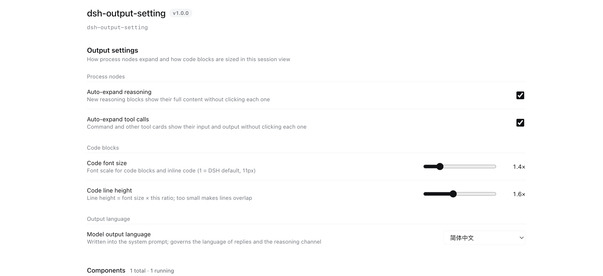

# dsh-output-setting

English | [简体中文](README.zh.md)

An output-presentation settings plugin for DSH (DeepSeek Harness). It gathers "how process nodes expand", "how large code blocks are" and "which language the model answers in" into a single settings page — all applied **live**, no restart needed.

Where to configure: **Plugins → dsh-output-setting** (the plugin's own detail page, not a separate group inside Settings).



## Settings

| Group           | Setting                | Type         | Default   | Description                                                        |
| --------------- | ---------------------- | ------------ | --------- | ------------------------------------------------------------------ |
| Process nodes   | Auto-expand reasoning  | switch       | on        | New reasoning blocks show their full content                       |
| Process nodes   | Auto-expand tool calls | switch       | on        | Command and other tool cards show input and output                 |
| Code blocks     | Code font size         | slider 1–3   | 1.4×      | Font scale for code blocks and inline code (1 = DSH default, 11px) |
| Code blocks     | Code line height       | slider 1–2.5 | 1.6×      | Line height = font size × this ratio                               |
| Output language | Model output language  | select       | Automatic | `Automatic` (follow UI language) / `简体中文` / `English`              |

"Model output language" is written into the **system prompt** (not AGENTS.md), so it also constrains the hidden **reasoning/thinking channel** — AGENTS.md arrives as a user message and cannot reach that channel.

## Install

Use the plugin manager; three sources work:

```
# 1. From GitHub (no npm publish needed)
plugin_manager(install_bundle, "github:yijiezhong/dsh-output-setting")

# 2. From npm (once published)
plugin_manager(install_bundle, "dsh-output-setting")

# 3. Local development: link the source directory
plugin_manager(install_bundle, "link:/path/to/dsh-output-setting")
```

Make sure `dsh-output-setting` ends up in the profile's `dsh.profile.bundles`
(the plugin manager does this for you; see below for the manual route).

<details>
<summary>Manual install</summary>

```sh
cd ~/.dsh/profiles/desktop
pnpm add github:yijiezhong/dsh-output-setting
node -e "const f='package.json',j=require('./'+f);j.dsh.profile.bundles.push('dsh-output-setting');require('fs').writeFileSync(f,JSON.stringify(j,null,2)+'\n')"
```

</details>

### Dependencies

```sh
npm install          # installs the @deepseek-ai/schemastery declared in package.json
```

`package.json` declares exactly one dependency:

```json
"dependencies": { "@deepseek-ai/schemastery": "~3.18.4" }
```

**Why pinned to 3.18.x**: on this machine the profile shared layer
(`~/.dsh/profiles/node_modules`) holds the old **3.18.1**, which has **no `.volatile()`**.
Desktop does not pass `bareModuleBaseUrl`, so bare specifiers resolve through plain Node
resolution — without a local copy the plugin hits the old version →
`z.number().volatile is not a function` → **module load fails → Config is missing → the
settings page never appears** (`listConfigs` reports `status: "absent"`, yet `fiberPhase`
still says `active`, which makes it very easy to misdiagnose). So it must ship its own 3.18.4.

**⚠️ Do not move it into `peerDependencies`** — as a peer it gets intercepted back to the
shared old 3.18.1 and the failure above returns. (This does not contradict official plugins:
they also keep schemastery in `dependencies` and only put `@deepseek-ai/cordis` in peer.)

`react` and `cordis` are **not declared** — the DSH runtime provides them (official client
plugins likewise only `require("react")` without listing it; official plugins were measured at
0 `import cordis` sites). `peerDependencies.cordis` was tried once and made npm pull a redundant
308K cordis copy into the plugin, so it was removed.

## Development notes

- **Changing the host half (`host.js`) requires an app restart.** `disable → enable`, renaming the
  file, and `remove + install` all fail to reload the module (Node caches ESM by URL; `dsh-hmr`
  only watches patch files). Verify a reload by writing a marker file as a side effect —
  **do not trust `fiberPhase`**.
- **Changing the client half (`client.js`) only needs a page refresh** (`Cmd+R`). Note that `Cmd+R`
  resets the whole DSH UI language to the browser language; switch languages from the settings panel
  when testing localization.
- The settings UI registers into **`plugins.bundle.config`** (a keyed slot, key = this package name)
  and renders between the plugin page's description and its component rows.

## License

MIT
