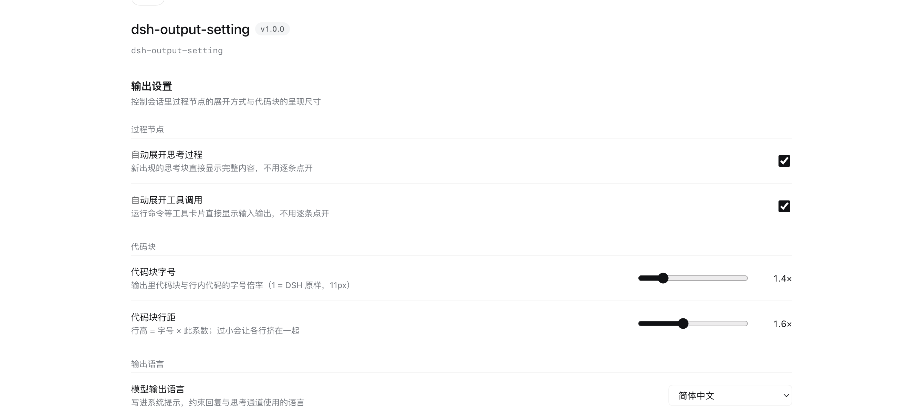

# dsh-output-setting

[English](README.md) | 简体中文

DSH（DeepSeek Harness）的输出呈现设置插件。把「过程节点怎么展开」「代码块多大」「模型用什么语言回答」集中到一个配置页里，全部**实时生效**，无需重启。

配置入口：**插件 → dsh-output-setting**（插件自己的详情页，不是「设置」里的独立分组）。



## 配置项

| 分组   | 配置       | 类型       | 默认   | 说明                               |
| ---- | -------- | -------- | ---- | -------------------------------- |
| 过程节点 | 自动展开思考过程 | 开关       | 开    | 新出现的思考块直接显示完整内容                  |
| 过程节点 | 自动展开工具调用 | 开关       | 开    | 命令等工具卡片直接显示输入输出                  |
| 代码块  | 代码块字号    | 滑块 1–3   | 1.4× | 代码块与行内代码的字号倍率（1 = DSH 原样 11px）   |
| 代码块  | 代码块行距    | 滑块 1–2.5 | 1.6× | 行高 = 字号 × 此系数                    |
| 输出语言 | 模型输出语言   | 下拉       | 自动   | `自动`（跟随界面语言）/ `简体中文` / `English` |

「模型输出语言」写进的是**系统提示**（不是 AGENTS.md），因此对隐藏的**思考/推理通道**同样有约束力 —— AGENTS.md 是以 user 消息注入的，管不住推理通道。

## 安装

已发布到 npm：[`dsh-output-setting`](https://www.npmjs.com/package/dsh-output-setting)。

推荐用插件管理器，三种来源任选：

```
# ① 从 GitHub 安装（无需先发布 npm）
plugin_manager(install_bundle, "github:yijiezhong/dsh-output-setting")

# ② 从 npm 安装（已发布）
plugin_manager(install_bundle, "dsh-output-setting")

# ③ 本地开发：直接 link 源码目录
plugin_manager(install_bundle, "link:/path/to/dsh-output-setting")
```

装完记得把 `dsh-output-setting` 加进 profile 的 `dsh.profile.bundles`
（插件管理器会自动处理；手工安装时见下方命令）。

<details>
<summary>手工安装步骤</summary>

```sh
cd ~/.dsh/profiles/desktop
pnpm add github:yijiezhong/dsh-output-setting
node -e "const f='package.json',j=require('./'+f);j.dsh.profile.bundles.push('dsh-output-setting');require('fs').writeFileSync(f,JSON.stringify(j,null,2)+'\n')"
```

</details>

### 依赖说明

```sh
npm install          # 装上 package.json 里声明的 @deepseek-ai/schemastery
```

`package.json` 只声明一个依赖：

```json
"dependencies": { "@deepseek-ai/schemastery": "~3.18.4" }
```

**为什么是精确到 3.18.x**：本机 profile 共享层（`~/.dsh/profiles/node_modules`）里那份是旧版
**3.18.1**，**没有 `.volatile()`**；而 Desktop 未传 `bareModuleBaseUrl`，裸模块名走 Node 原生解析，
插件不自己带新版就会命中旧版 → `z.number().volatile is not a function` →
**模块加载失败 → Config 缺失 → 配置页不出现**（`listConfigs` 报 `status: "absent"`，
但 `fiberPhase` 仍显示 `active`，极易误判）。所以必须自带一份 3.18.4。

**⚠️ 不要把它改成 `peerDependencies`** —— 声明成 peer 会被 DSH 的拦截机制重新导向共享层的
旧版 3.18.1，上面那个失败就会复现。（这条与官方插件不冲突：官方把 schemastery 放在
`dependencies`，只把 `@deepseek-ai/cordis` 放 peer。）

`react` 与 `cordis` **都不声明** —— 它们由 DSH 运行时提供（官方客户端插件同样只 `require("react")`
而不在清单里声明；也实测过官方插件 0 处 `import cordis`）。曾经加过 `peerDependencies.cordis`，
结果 npm 会自动在本插件里装一份 308K 的 cordis，属于冗余，已移除。

## 开发须知

- **改 host 半（`host.js`）必须重启应用**才生效：`disable → enable`、改文件名、
  `remove + install` 都**不会**重新加载模块（Node ESM 按 URL 缓存，`dsh-hmr` 只监听 patch 文件）。
  判断是否真的重载，用副作用写文件验证，**别信 `fiberPhase`**。
- **改 client 半（`client.js`）刷新页面即可**（`Cmd+R`）。但注意 `Cmd+R` 会把整个 DSH 界面
  语言回落成浏览器语言，验证双语时请在设置面板里切语言。
- 配置界面注册在 **`plugins.bundle.config`**（keyed slot，key = 本包名），
  渲染在插件详情页「描述」与「包含的组件」之间。

## License

MIT
